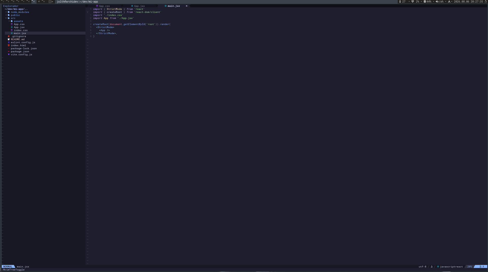

# nvim-react

> "Una configuración moderna, rápida y minimalista de Neovim basada en Lua, diseñada para el desarrollo eficiente en React."



## ✨ Características Principales

- ⚡ **Rendimiento:** Carga ultrarrápida gracias a la configuración en Lua.
- 🎨 **Estética:** Temas y fuentes optimizados para reducir la fatiga visual.
- 🛠️ **Funcionalidad:** Autocompletado (LSP), búsqueda difusa y gestión de archivos integrada.
- 🔌 **Extensible:** Estructura modular fácil de personalizar.

## 🚀 Instalación

### Requisitos Previos

Antes de comenzar, asegúrate de tener instaladas las siguientes herramientas:

- **Neovim** (versión 0.11.0 o superior)
- **Git**
- **Una Nerd Font** (necesaria para mostrar los iconos correctamente)
- Dependencias externas (opcional según tus plugins): `ripgrep`, `fd`, `node.js`, etc.

### Pasos de Instalación

1.  **Haz una copia de seguridad** de tu configuración actual (si tienes una):
    ```bash
    mv ~/.config/nvim ~/.config/nvim.bak
    mv ~/.local/share/nvim ~/.local/share/nvim.bak
    mv ~/.local/state/nvim ~/.local/state/nvim.bak
    ```

2.  **Clona este repositorio** en la carpeta de configuración de Neovim:
    ```bash
    git clone git@github.com:jolth/nvim-react.git ~/.config/nvim
    ```

3.  **Inicia Neovim** para instalar los plugins automáticamente (se ejecutará el gestor de plugins al arrancar):
    ```bash
    nvim
    ```
    *Espera a que termine la instalación de los plugins. Puede tardar unos segundos la primera vez.*

## ⌨️ Comandos y Uso

Una vez instalado, así es como puedes interactuar con el entorno:

### Comandos del Líder (Leader Key)
La tecla líder está configurada como `<Espacio>`.

| Teclas | Descripción |
| :--- | :--- |
| `<Espacio> + f` | Buscar archivos en el proyecto |
| `<Espacio> + /` | Buscar texto en todos los archivos |
| `<Espacio> + e` | Explorador de archivos |
| `<Espacio> + q` | Salir de Neovim |
| `<Espacio> + w` | Guardar archivo |
| `<Espacio> + h` | Mostrar ayuda de teclas (WhichKey) |

### Comandos Internos
- `:Lazy` - Abre el gestor de plugins para actualizar o revisar el estado.
- `:LspInfo` - Muestra información sobre los servidores LSP activos.
- `:Mason` - Interfaz gráfica para instalar herramientas LSP, linters y formateadores.

## 🛠️ Personalización

Para modificar el comportamiento o añadir plugins:

1.  **Plugins:** Edita el archivo `lua/plugins/init.lua` (o la carpeta correspondiente en tu estructura).
2.  **Opciones:** Modifica `lua/config/options.lua` para cambiar configuraciones generales.
3.  **Atajos:** Edita `lua/config/keymaps.lua` para redefinir teclas.

Recarga la configuración con `<Espacio> + c` o reinicia Neovim para aplicar los cambios.

## 📂 Estructura del Proyecto

```text
~/.config/nvim
├── lua
│   ├── config        # Configuración base (opciones, atajos)
│   ├── plugins       # Definición de plugins
│   └── modules       # Módulos personalizados
├── init.lua          # Punto de entrada principal
└── README.md         # Este archivo
```

##  Desinstalar

```bash
# Linux / MacOS (unix)
rm -rf ~/.config/nvim
rm -rf ~/.local/state/nvim
rm -rf ~/.local/share/nvim
```

## 📜 Licencia

Este proyecto está bajo la licencia [MIT](LICENSE).

## 🤝 Contribuir

Las contribuciones son bienvenidas. Por favor, lee el archivo [CONTRIBUTING.md](CONTRIBUTING.md) para detalles sobre cómo enviar pull requests.

---
*Hecho con ❤️ y Neovim.*
